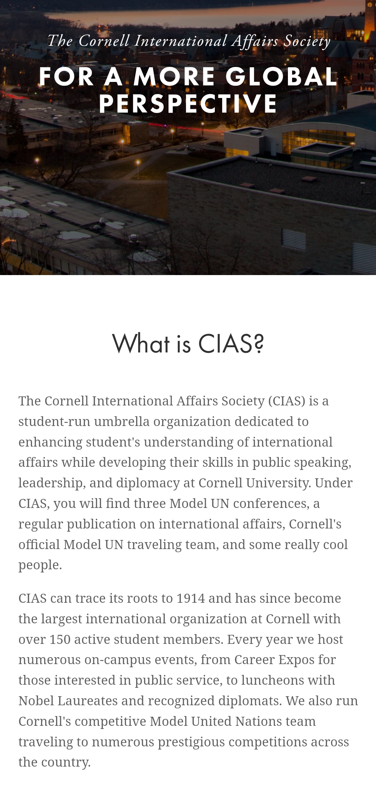
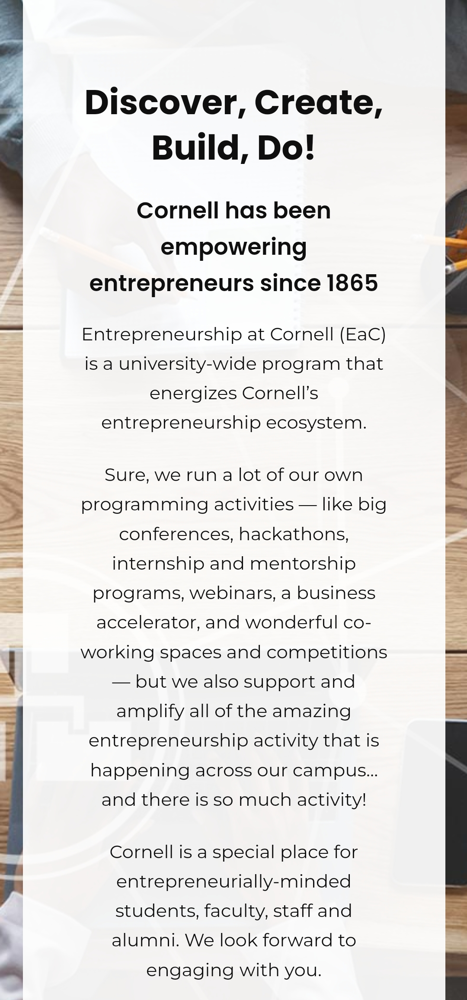
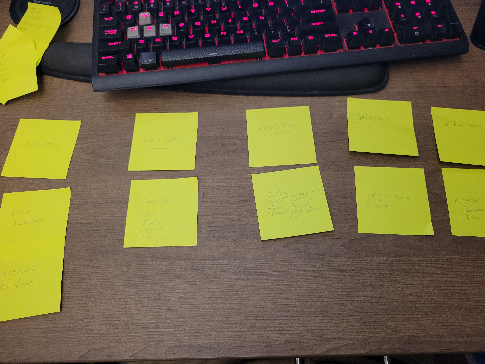
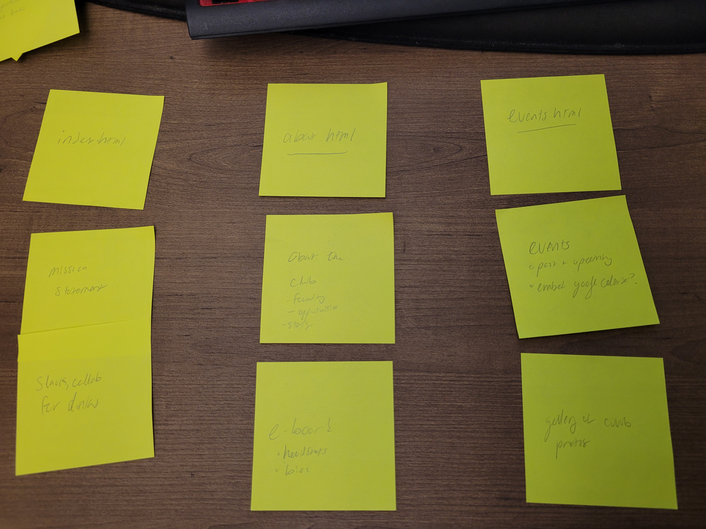

# Project 1: Design Journey

**For each milestone, complete only the sections that are labeled with that milestone.** Refine all sections before the final submission.

You are graded on your design process. If you later need to update your plan, **do not delete the original plan, leave it in place and append your new plan _below_ the original.** Then explain why you are changing your plan. Any time you update your plan, you're documenting your design process!

**Replace ALL _TODOs_ with your work.** (There should be no TODOs in the final submission.)

Be clear and concise in your writing. Bullets points are encouraged.

**Everything, including images, must be visible in _Markdown: Open Preview_.** If it's not visible in the Markdown preview, then we can't grade it. We also can't give you partial credit either. **Please make sure your design journey should is easy to read for the grader;** in Markdown preview the question _and_ answer should have a blank line between them.

## Personal Site (Milestone 1)

### Website Topic (Milestone 1)
> Briefly explain what your website will be about. Share your vision of your personal website.
>
> My website is for my photography and videography club, Capture @ Cornell. It will be a simple page aimed to inform prospective members to joining, and for other organizations to easily start the process to collab with us. It will only

### Device (Milestone 1)
> How you will your audience likely access your website? On a laptop/desktop computer or a mobile device?
> You will design your website for mobile or desktop devices (not both).

The page will likely be viewed on a mobile device - either the user has scaned a QR code or typed the link; they likely intend to find our Instagram, which is more mobile friendly.

## Personal Website Design Exploration (Milestone 1)

Identify three personal websites (preferably static websites) that exist today on the web. You will be drawing inspiration from these sites for your own site; please select websites that are similar to the website you wish to create.

Include a screenshot of the home page for each site. If you're planning a mobile website, your screenshots should be from a mobile website. If you're planning a desktop website, your screenshots should be from a desktop website.

**We'll refer to these are your "example websites."**

1. <https://thecias.org>

    

2. <https://www.eship.cornell.edu>

    

3. <https://www.gionedasilva.com>

    

### Personal Website 1 Review (Milestone 1)
> Review the personal website you identified above. (1-2 paragraphs)
>
> - Who do you think this site is designed for? Who is its intended audience?
> - What **goals** do you think the audience likely has when visiting this site.
> - What **content** is included?
> - Do you believe the content likely **addresses** the goals of the site's audience?
> - What do you like about the design?
> - Is the site designed for desktop, mobile, or desktop and mobile devices?

This page is designed for students interested in the Cornell International Affairs Society perhaps high schoolers looking forward to the upcoming conference held by CIAS, or Cornellians who were previously a part of MUN in high school. It contains a mission statement and description of the club. The audience likely hopes to learn more about the club and to find contact information about its officers. Content includes a picture of Cornell, a tagline, and two paragraphs outlining the purpose of CIAS. The design is simple and straightforward, and fits both desktop and mobile.

### Personal Website 2 Review (Milestone 1)
> Review the personal website you identified above. (1-2 paragraphs)
>
> - Who do you think this site is designed for? Who is its intended audience?
> - What **goals** do you think the audience likely has when visiting this site.
> - What **content** is included?
> - Do you believe the content likely **addresses** the goals of the site's audience?
> - What do you like about the design?
> - Is the site designed for desktop, mobile, or desktop and mobile devices?

The Entrepreneurship at Cornell page is intended for students interested in the club and its events, usually self-proclaimed entrepreneurs looking to network and meet other people. Audience members want to learn more information about the club and find ways to join, contact the club, see upcoming events, and reserve a spot in them. Content on the home page is just text about the club a high overview on what the club does. The design is simple and likely works on mobile an desktop.

### Personal Website 3 Review (Milestone 1)
> Review the personal website you identified above. (1-2 paragraphs)
>
> - Who do you think this site is designed for? Who is its intended audience?
> - What **goals** do you think the audience likely has when visiting this site.
> - What **content** is included?
> - Do you believe the content likely **addresses** the goals of the site's audience?
> - What do you like about the design?
> - Is the site designed for desktop, mobile, or desktop and mobile devices?

This website is intended for potential clients and those interested in their portfolio, perhaps engaged couples or other photographers. The audience likely intends to see the photog's work and possibly find a time to book them. Content is a short bio of the photographer written in the third person. The website seems successful in informing its users and addressing their goals. The simple layout and parallax scroll proves to be simple and elegant for mobile and desktop.

## Audience & Goals (Milestone 1)

Using what you learned from studying the example websites, identify your website's audience and their goals.

### Audience (Milestone 1)
> Briefly explain who the intended audience is for your website. Be specific and justify why this audience is appropriate for your site's topic.

This site is largely intended for Cornell students who have heard of Capture at Cornell and want to learn more, and/or students who want to join the club. Eboard members of other clubs may also use this website to learn how to start a collab with us. to be using.

### Audience Goals (Milestone 1)
> Why would your audience visit your site?
> Identify at least 3 goals that your users have for visiting your website.

1. Paramount, a user would like to learn more about the club and what it has to offer.

2. From there, a user may wish to see social media, such as Instagram to learn even more.

3. Moreover, the user may wish to collab with C@C, this they will look for the collab form.

## Content Planning (Milestone 1)

Plan your site's content.

### Your Site's Planned Content (Milestone 1)

> List **all** the content you plan to include your personal website.
> You should list all types of content you planned to include (i.e. text, photos, images, etc.)

- Provide a mission overview and description of the club and what it does.
- Provide helpful links to social media, collab form, contact form, join form.
- A logo of C@C
- Some photos of the club in the action in g-body meetings, collabs, photowalks
- An attached constitution

### Content Justification (Milestone 1)
> Explain (about a paragraph) why this content is the right content for your site's audience and how the content addresses their goals.

 The website will be static and simple - largely plaintext with links to our social media and collab form being most important.The site is intended to be the starting point for those interested in joining C@C - and those who want to learn more or are looking to collab, the simple website will make it easy to navigate to these desired destinations. The site will be designed for mobile as that is what most users are expected. It is intended that the audience will have their goals addressed quickly on this website, or more thorughouly in subsequent pages such as social media or the collab form.

### Home Page Content (Milestone 1)
> What is the content that your users would expect when visiting your site for the first time.
>
> Briefly identify what content you will include on the homepage and why this content should be the first thing your target audience sees when they visit your site.

- C@C logo is the most important - branding is paramount
- A brief description of the club, its mission statement, and what it has to offer - important so users can quickly understand context of the club
- Further links to social media and a collab - allows quick and easy navigation, no need to go to different pages or hunt for the link.

## Information Architecture (Milestone 2)

For milestone 2, you will design the information architecture for all the pages your website.

You may change your homepage content based on your card sorting. If you do change the homepage content, don't update it above, just include the new plan in the section below (Content Organization).

### Content Organization (Milestone 2)
> Document your **iterations** of card sorting here. You must have at least 2 iterations of card sorting.
> Include photographic evidence of each iteration of card sorting **and** description of your thought process for each iteration.
> Please physically sort cards; please don't try and do this digitally.

Iteration 1:

The first iteration, I organized marjority of the content onto its own page. This made for many short pages.

Iteration 2:

The second time, I merged some of the content to the same page to make for simpler navigation and fewer pages.

### Final Content Organization (Milestone 2)
> Which iteration of card sorting will you use for your website?

I will be using iteration 2. I believe this will provide a more concise and navigable website for users. The content continues to target students and individuals interested in our club. It's content is helpful for current and prospective members to keep track of what the club is up to, to learn more about the club, and how to join or organize a collab.

### Navigation (Milestone 2)
> Please list the pages you will include in your website's navigation.

1. homepage
2. About page
3. Events page

> Explain why the names of these pages make sense for your site's audience.

The homepage will contain the pertientn links as well as a quick blurb about the club. Those who want to learn more *about* the club can go to the about page to learn about its founding, its eboard, and more. The events page will house past and future events, and pictures from the events. This simple layout allows for users to know exactly what they are getting into and be able to easily retrieve the information they are looking for.

## Visual Themes (Milestone 3)

**Make the case for your decisions using concepts from class, as well as other design principles, theories, examples, and cases from outside of class.**

Remember to focus on the things we can't see just by looking at the site: changes, alternatives considered, processes, and justifications.

Each section is probably around 1 reasonably sized paragraph (2-4 sentences).

### Theme Ideas (Milestone 3)
> Discuss several (more than two) ideas about styling your site's theme. Explain why the theme ideas are appropriate for your target audiences.

Following the theme of C@C, one theme idea could be a red background with white text. The headings in black would work to represent the colors of the club.

Another idea could be to simply all text, and just stylize certain elements with a red accent. 

Using red headings and black text could help to organize content in a stylish way - and the background could take a neutral grey color.

All of these themes work to stylize content in a manner that is consistent with the colors of C@C and its mission as a photo club.

### Final Theme (Milestone 3)
> Which theme did you select as your final theme? Why?

The intent of this website is to represent C@C on the web. Our main colors are red (carnelian, in fact!) and white. The site is intended to be simple and mainly static text, thus a white background and with red accenting is the intended theme. For example, strong elements will be red, and links will be stylized red instead of blue. No background color or major changes to heading colors seems necessary, although I may choose to target h1 to be red. 

### Theme Rationale (Milestone 3)
> Discuss your final theme design: how do they fit your overall design goals and audiences?

Of paramount is readability and simplicity. The website is largely intended for reference and quicklinks. So, a website that is easy to navigate, find content, and click links is important. So using high contrast text, a white background and few other style choices should reach this goal

> Emotion is a big part of design. What emotions were you thinking about or trying to convey in your designs?

Thus a theme that conveys the professionalism and friendliness of a photography club is required. The red color and sans-serif font will lead to a friendly but straight-forward layout. It is hoped to invoke a neutral response - but to convice those interested in the club to join or learn more through pictures and events (i.e. content, not style). 

## Layout & Composition (Final Submission)

### Home Page Layout (Final Submission)
> Include several sketches of possible layout ideas for the home page.
> Provide an explanation for each sketch explaining the idea.
> Show your design process.
> **Use the example websites above as inspiration for your site's design.**

TODO: layout sketches

### Final Site Design (Final Submission)
> Include a sketch of the final layout for each page in your site.
> Provide an explanation below each sketch.

TODO: site sketches

### Static Website Design Check (Final Submission)
> We're building a static website without interactivity.
> **No part of your website may dynamically change.**
> Examples of dynamic behavior are dropdown menus, hamburger menus, popups, modals/lightboxes, image carousels, etc.
>dfd
> Audit your design and check that you aren't relying on any dynamic features.

This website is completely static because it need not be updated often. Largely this site is for reference, that is, for users to visit when they need a link or more information. Periodically, content, such as events and the e-board will be updated, but they will still be static elements.

## Rationale (Final Submission)

**This rationale should be polished writing:** one you might submit as a report to a client or boss to help explain the project and convince them you did a good job. You'll be surprised how much writing and communicating you need to do about projects and choices on internships and jobs; practice that here.

It should be a comprehensive, complete story of the project. You might find that each section runs a few paragraphs (1-2). Sketches can often help tell the story of your design. Screenshots are also useful for describing issues discovered during the design process and how you addressed them.

**All images must be visible in "Markdown: Open Preview" for credit!**

Your rationale should be a polished version of the earlier explanations.

### Audience (Final Submission)
> A complete and polished description of the intended audience(s) for your website.

The audience continues to be students of Cornell and those interested in learning more about the club. That tends to be photographers and videographers, as well as members and individuals of other clubs or organizations looking to collab with our club. Site visitors likely want to learn more about the club and understand what the club has to offer.

### Design Goals (Final Submission)
> An explanation of the design goals for that audience, based on your earlier rationales.

Mainly, this website will be used for reference, to quickly find upcoming events, relevant links, etc. As such, navigation is straightforward and obvious. The simple bi-color scheme allows for accenting and emphasis on certain content, but nothing over-the-top and overbearing. The text face and header style clearly devises sections and allows for users to find and skip to their desired content easily.

### Content Organization & Navigation (Final Submission)
> An explanation of how the final content organization and navigation met your goals and why it's appropriate for your audience.

Content is separated into three pages. The main page, index.html, contains what most site-users will be looking for: a quick description of the club, and relevant links. Most users, especially those who have seen the website before, will only require the links. The about page, about.html, contains more expository on the club, including its origin, its e-board, and its constitution. Finally, the events page contains upcoming and past events for the club. This gives a concrete description of what the club has to offer. All these pages work together to give site visitors an idea of the club, and actionable choices to fufill what they are looking for.

### Visual Design (Final Submission)
> An explanation of how the final design met your goals and why it's appropriate for your audience.

As mentioned before, the simple coloring displays a page that is easy and simple to use. It is visually pleasing, and matches the color palette of the C@C branding. The accent color, "Capture Red," is used sparingly, to draw attention to headings and links. The rest of the text is a black, contrasted with a white background. The text font is sans-serif, which gives a non-formal style, as this club is intended for anyone and everyone. The small-caps header choice is purely stylistic, but tends to give a young and more active effect. Em elements are highlighted in grey and bold and italic - this is used for slogans and important text, and is thus more noticable than other content. Finally, the e-board about site has its members and member photo side-by-side - allowing for a visually pleasing and less lengthy site.

### Self-Reflection (Final Submission)
> Take some time here to reflect on how much you've learned since you started this class. It's often easy to ignore our own progress. Take a moment and think about your accomplishments in this class. Hopefully you'll recognize that you've accomplished a lot and that you should be very proud of those accomplishments!

As I progressed through the milestones, the site saw a number of change, primarily additions of content that were previously forgotten. I intend to use this website for my club, so it was important to do it right, and make it scalable and maintainable for the future; thus best practices and good organization had to be used. I enjoyed building this website from the ground up, and found most of its straightforward. However, playing with flexboxes was sometimes frustrating. I conferred with my e-board about style choices, but we always erred on the side of simplicity - thus the website in its form. The website will still be updated in the future, but I believe this is a strong start.

In the future, I hope to make this website also cater to mobile, and likely will embed a Google Calendar of upcoming events, rather than manually update the website. Moreover, I will add a list-serv sign-up, which is currently not working. I also intend to add more images of the club being active, and may use image carousels for that purpose.

## Grading (Final Submission)

### Mobile or Desktop? (Final Submission)
> Should the graders, grade your site as a desktop site or a mobile site?

Desktop.

### Grading: Open the Design Journey in Markdown: Open Preview (Final Submission)
> Preview your design journey in VS Code. Please verify that this document is easy to read/grade.
>
> - Remove all _TODOs_
> - All images must be visible.
> - All images must be oriented the correct way.
> - There should be a blank line between the question prompt and your answer.
>
> Is your design journey easy to read?

TODO: design journey ready to grade?

### Collaborators
> List any persons you collaborated with on this project.

None.

### Resources
> Please cite any external resources you used in the creation of your project.

None.